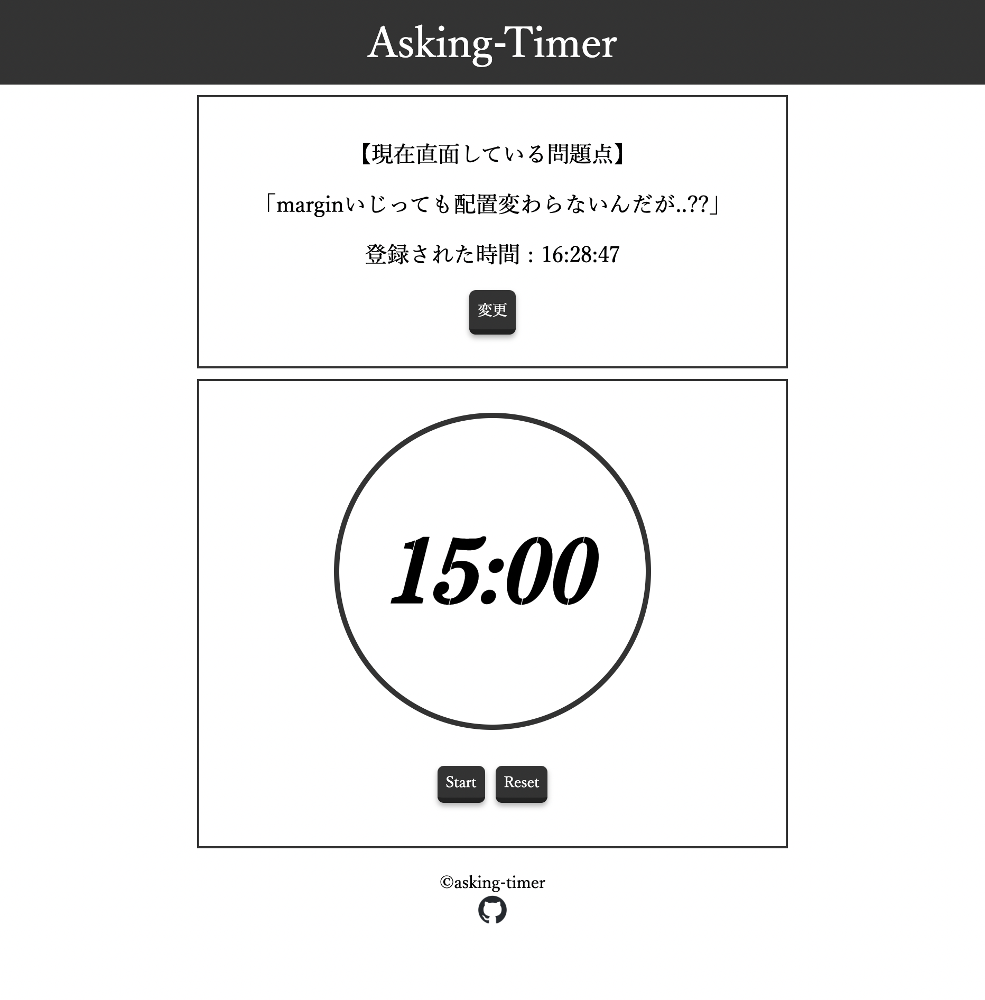

# asking_timer
## 概要
15分ルールに従って質問をしに行くことをアラートしてくれるタイマーアプリです。


## 実装
シングルファイルコンポーネント(SFC)とCompositionAPIを用いてVue.jsで実装しています。
(Timer.vueだけは最初に書いたのでOptionsAPIで記述しています。)


## Project setup
```
npm install
```

### Compiles and hot-reloads for development
```
npm run serve
```

### Compiles and minifies for production
```
npm run build
```

### Lints and fixes files
```
npm run lint
```

### Customize configuration
See [Configuration Reference](https://cli.vuejs.org/config/).
